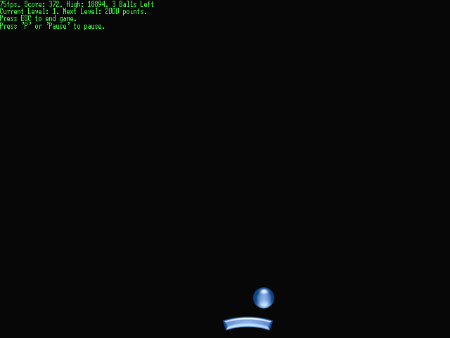



## PingBall Challenge \(A complete DirectDraw game and tutorial\)

### Description

Shows how to make DirectDraw games, and offers a COMPLETE game. Can you beat this game? I honestly don't think so. 

In-depth tutorial, and code explanation included.
 
### More Info
 

             |
---                |---
**Submitted On**   |2002-06-28 12:10:14
**By**             |[XA](https://github.com/Planet-Source-Code/PSCIndex/blob/master/ByAuthor/xa.md)
**Level**          |Intermediate
**User Rating**    |5.0 (30 globes from 6 users)
**Compatibility**  |VB 5\.0, VB 6\.0
**Category**       |[Graphics](https://github.com/Planet-Source-Code/PSCIndex/blob/master/ByCategory/graphics__1-46.md)
**World**          |[Visual Basic](https://github.com/Planet-Source-Code/PSCIndex/blob/master/ByWorld/visual-basic.md)
**Archive File**   |[PingBall\_C997456282002\.zip](https://github.com/Planet-Source-Code/xa-pingball-challenge-a-complete-directdraw-game-and-tutorial__1-36204/archive/master.zip)

### Source Code

PingBall Challenge

A complete DirectDraw 7.0
Game/Tutorial.

   <a href="#DirectDraw Game Tutorial">Click here</a> to skip the
rules, and go on to the Tutorial.

<h2 style='text-indent:36.0pt'>PingBall Challenge Rules</h2>

You are given 3 balls. You have to
keep the ball in the air for the longest amount of time possible. If a ball
falls, you can continue to the next ball, until you run out of balls.

 There is a total of 7 levels: you
start on first, second starts when you get 2000 points, 3rd on 4000, 4th on
8000, 5th on 16000, 6th on 32000, and 7th on 64000. To fully complete the game,
you need to get more than 128000 points. The game has no 'finish', so you can
continue playing as long as you want. The difference between the levels is only
graphics. On every new level achieved, you are given one more ball.

 You can pause the game at any
time, by pressing 'P' or 'Pause' key.

 PingBall should be played at
800x600x16 , but other modes are possible.

<h2 style='text-indent:36.0pt'> <a name="DirectDraw Game Tutorial">DirectDraw Game
Tutorial</a></h2>

 First of
all, I cannot claim any part of the Enumeration (frmSet) , since it was written
by Jack Hoxley (www.directx4vb.com). 

I will
just explain what the code does here, you have the code (you can download it at
the end of the article)...

 As you
see, frmMain is a pretty blank form - no picture/image boxes, nothing except for
two timers. One of them is responsible for calculating frame rate (should be
around 75 fps, if it is less, the game feels uncomfortable), and the other does
part of the scoring.

 The
program is started from Sub Main, located in modMain, which checks the command
line for the keyword 'settings'. If it is present, frmSet is loaded. If not,
frmMain is loaded, and the game is played.

frmSet (if run) checks all available resolutions, filters the junk ones (small
color depth and resolution) out, and lists your hardware compatibilities. 
It can also change the resolution at which PingBall is played.

On loading frmMain calls the Sub Init. What that does, is it creates DirectDraw
(<i>dx.DirectDrawCreate("")</i>). "" Specifies that we will be using the default
graphics card and display.

<i> Call dd.SetCooperativeLevel(Me.hWnd, DDSCL_FULLSCREEN Or
DDSCL_ALLOWMODEX Or DDSCL_EXCLUSIVE)</i> tells DirectDraw that we will be using
the full-screen mode, and that we want exclusive access to the screen. It also
binds DirectDraw to frmMain.

The next few lines load the resolution. XTract function is used to extract
numbers from the 90x090x09090x909090x90909 format.

<i>Call dd.SetDisplayMode(w, h, d, 0, DDSDM_DEFAULT)</i> sets the screen
resolution

The next lines create primary surface, and backbuffer. Those surfaces will be
used to show pictures  - backbuffer is used so that user won't see any
flickering.

High score is then loaded.

The next loop is the game itself. It repeats a combination of the game splash
screen, followed by the game forever. The SplashEngine will exit itself when
ENTER is pressed, and the GameEngine will exit either on ESC or when you lose.

SplashEngine is quite simple: all it does is it calculates the location of the
pinger (the board that you are supposed to catch the ball with), and uses
SplashBlt sub to blit it.

SplashBlt simply calls the backbuffer.bltFast (), and backbuffer.DrawText to
show you the splash screen. The backbuffer is then <i>flip</i>ed onto the
primary surface by using <i>primary.Flip Nothing, DDFLIP_WAIT</i>.

GameEngine is a little more complex: it has to move the ball, and make collision
detection between pinger and the ball. Notice that it sometimes calls the
IncreaseBallSpeed sub, which simply increases the ball's speed (if it is passed
True, it will also <i>invert</i> the ball's SpeedY). Also notice that I use a
user-defined Location type - it tells me where the objects are (X, Y
properties), and their movement direction and speed (SpeedX, SpeedY). GameEngine
also sets Loss (or Lose... can't remember) property when the player had lost.

GameBlt then blits the images onto the backbuffer, and flips it onto the screen.

PauseEngine and PauseBlt work by the same principle.

CheckScreen (you will see it in any Blt sub), is used to check if we have the
screen (user didn't just Alt-Tab), and restore the surfaces if the user did.

Surfaces... imagine them as pictures. They have to be described, and then
loaded/created. My <i>InitSurfaces</i> sub handles the creation of surfaces from
images. It is quite self-explanatory.

One sub that you might want to copy is the <i>UniversalLoad</i>. What it does it
provides a simple way to load .jpg and .gif (and other VB supported Pictures)
into DirectDraw surfaces. DirectDraw doesn't allow us to use anything except for
.bmp files for surfaces, and this sub checks if the file is bmp. If it's not, it
is loaded and re-saved as bmp, the surface is then loaded, and the temporary bmp
file deleted.

MovePinger is the sub responsible for moving the pinger - it is used in
conjunction with Form_Keydown. By pasting the following code into it, you can
make you pinger to be able to go up and down (if level >= 4; this is set in the
Form_Keydown sub):
<p'>
If PingerLoc.SpeedY <> 0 Then 
    If PingerLoc.y + PingerLoc.SpeedY >= 0 And _ 
       
PingerLoc.y + ddsd4.lHeight + PingerLoc.SpeedY <= ddsd3.lHeight Then 
       
PingerLoc.y = PingerLoc.y + PingerLoc.SpeedY 
   
End If 
End If

Need more information? Visit <a href="http://www.directx4vb.com">
www.directx4vb.com</a> , a very nice resource.

<b>THE END</b>

<b>P.S. </b>Can you really beat all the 7 levels?
I honestly don't think so. Try, though, and post your results.

